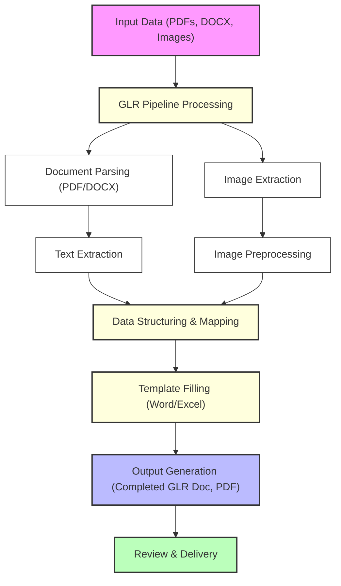

# GLR Pipeline Input Data - Project Overview

## 📄 Project Purpose
This project is designed to automate the processing of insurance claim documents and images, transforming raw input data (PDFs, DOCX, images) into structured, completed GLR (General Loss Report) documents and reports. The pipeline streamlines the extraction, mapping, and templating of data for efficient claims handling.

---

## 🚀 Workflow Overview

---

## 🗂️ Folder Structure

- **Example 1 - USAA/**
  - Input/
    - Form Example UX.pdf
    - photo report.pdf
    - USAA 800 Claims GLR Template 4-24.docx
  - Output/
    - Completed GLR Word Doc.docx
    - Completed GLR Word Doc.pdf
- **Example 2 - Wayne-Elevate/**
  - Input/
    - Elevate_Wayne Template Report_XM8.docx
    - Form Example UX-2.pdf
    - Photo Report - 2.pdf
  - Output/
    - Completed GLR Word Doc-ex2.docx
    - Completed GLR Word Doc-ex2.pdf
- **Example 3 - Guide One - Eberl/**
  - Input/
    - Eberl-GuideOne REPORT TEMPLATE_XM8.docx
    - Form Example UX-2.pdf
    - Photo Report - 3.pdf
  - Output/
    - Completed GLR Word Doc-ex3.docx
    - Completed GLR Word Doc-ex3.pdf

---

## 🔍 How the Pipeline Works

1. **Input Collection**: Collects raw claim forms, templates, and photo reports (PDF, DOCX, images).
2. **Document Parsing**: Extracts text and tables from PDFs and Word documents using OCR and document parsers.
3. **Image Extraction & Preprocessing**: Extracts and preprocesses images for clarity and consistency.
4. **Data Structuring & Mapping**: Maps extracted data to a structured format (e.g., JSON, DataFrame) for easy template filling.
5. **Template Filling**: Automatically fills out the GLR template (Word/Excel) with the mapped data.
6. **Output Generation**: Produces completed GLR documents in DOCX and PDF formats, ready for review and delivery.

---

## 🛠️ Technologies & Libraries Used

- **Python**: Main scripting language
- **pandas**: Data structuring and manipulation
- **python-docx**: Word document parsing and templating
- **PyPDF2 / pdfplumber**: PDF parsing and text extraction
- **OpenCV / PIL**: Image extraction and preprocessing
- **OCR (Tesseract or similar)**: For extracting text from scanned documents
- **Jinja2**: For advanced templating (if needed)

---

## 📦 Example Use Cases

- Automating insurance claim report generation
- Extracting structured data from mixed-format claim packets
- Reducing manual data entry and errors in claims processing

---

## 💡 Creative Highlights
- **End-to-End Automation**: From raw input to ready-to-send GLR reports
- **Flexible Input Handling**: Works with PDFs, DOCX, and images
- **Template-Driven**: Easily adaptable to new report formats
- **Visual Pipeline**: See the workflow in the diagram above!

---

## 👩‍💻 Getting Started

1. Place your input files in the appropriate `Input/` folder for your example.
2. Run the GLR pipeline script (see main project for details).
3. Find your completed GLR documents in the `Output/` folder.

---

## 📬 Contact & Support
For questions or support, please contact the project maintainer or open an issue in the main repository. 
